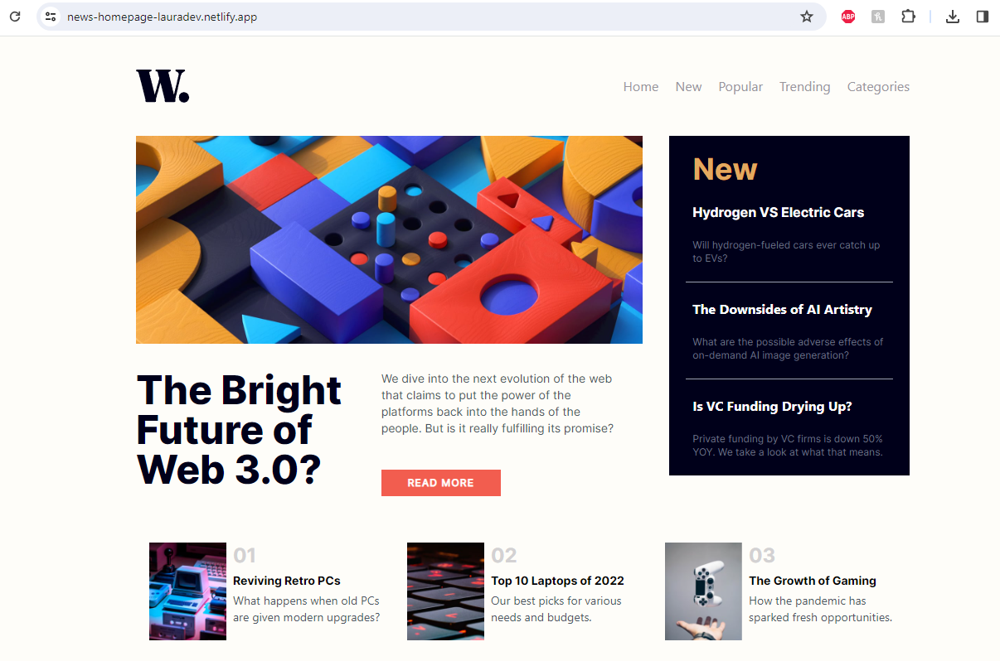
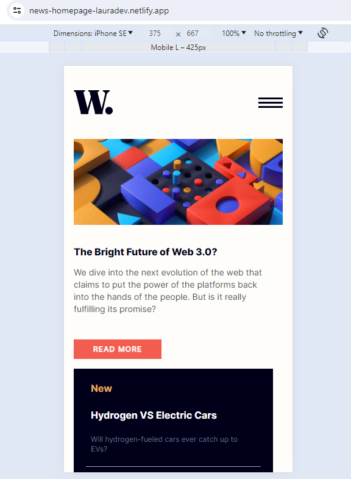
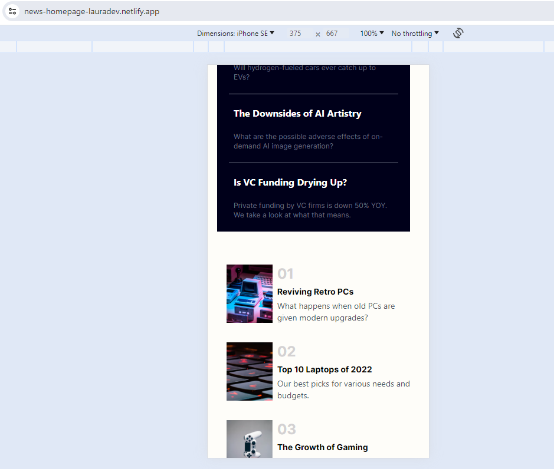
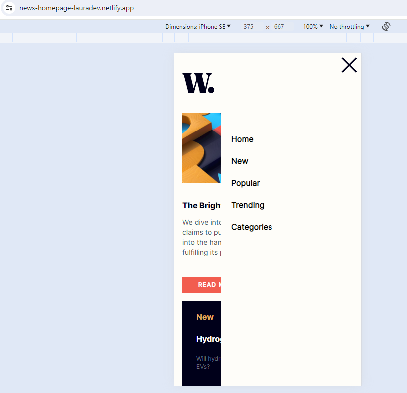
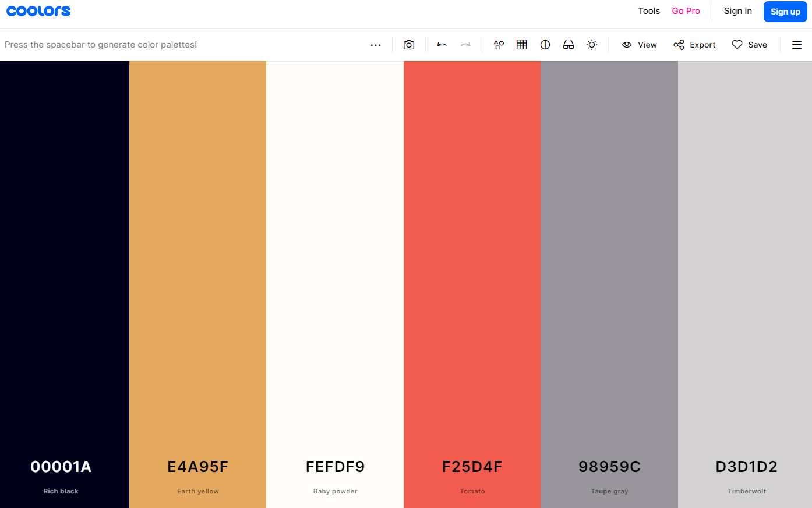

# News-Homepage

I created a News website homepage based on an example provided to me for design that I needed to match 1:1. The design image was provided with no additional help regarding code or framworks to use. The main technical frameworks I used were ReactJS, JavaScript, TailwindCSS, and Vite. 

## Table of contents

- [Overview](#overview)
  - [The challenge](#the-challenge)
  - [Screenshots](#screenshots)
  - [Links](#links)
- [My process](#my-process)
  - [Built with](#built-with)
  - [What I learned](#what-i-learned)
  - [Continued development](#continued-development)
  - [Useful resources](#useful-resources)
- [Author](#author)
- [Acknowledgments](#acknowledgments)

## Overview

The project encompassed creating a News homepage using ReactJS, Tailwind CSS, JavaScript and Vite. I was given a folder of assets including design examples, images, logos, and fonts to use. The images included computer and gaming images. The fonts was Inter Regular, Inter  Bold and Inter ExtraBold. The website included a logo in the top left corner, a navigation bar on desktop, a navigation side bar that would open by hamburger style for mobile, three distinct sections, a button to read more and additional functionality features. The project included specific color combinations, styling and knowledge of grid container layouts.

### The challenge

Users should be able to:

- View the optimal layout for the interface depending on their device's screen size
- See hover and focus states for all interactive elements on the page

### Screenshots


Website Screenshots:

Netlify Deployed Website by Me (Desktop)



Example Desktop Website


Mobile Screenshots:


Netlify Deployed Website by Me (Mobile)




Example Mobile Screenshot


Navigation Bar Screenshot:

Navigation Bar in Mobile Website by Me



Example Navigation Screenshot


### Links

- Github Repo: [Github Repo news-homepage] https://github.com/lavollmer/news-homepage
- Live Site URL: [News Homepage Netlify](https://news-homepage-lauradev.netlify.app/)

## My process

My process for building this website involved planning, building and refractoring code. This project took me about 1.5 business days to complete start to finish.

See below my steps to completing it:
1. Set up Github Repo - The first steps to my process were to set up my Github Repo publicaly. I created a Github Repo called news-homepage. After that, I synced my Github Repo with my local machine and intiatlized the Repo. 
2. Set up React/Vite/Node.js/TailwindCSS in my project - For the design aspect I chose to use Tailwind CSS. It is a utility-first CSS framework that provides a wide range of pre-defined classes to style your website or application.
3. Before continuing on any coding, I ran "run npm dev" to see the basic website and that everything was functioning properly. I also made my first few commits to check that my Github was set up properly.
4. After everything was running smoothly, I reviewed the notes and layout for the news-homepage design challenge. I thought about how to create reusable components, the best way to format the grid container, as well as any other minor details (colors, fonts, etc).
5. Next I set up my site on Netlify. This allowed me to configure my repository to publish my code to a web address. My Netlify website is avilable to view in the Links section of this README.
6. After this, I did more planning with the design using ReactJS, Tailwind CSS and JavaScript.
  a. The given images, layout and font were in a zip file. I extracted the zip file to open images and be able to move into the assets/images folder within the src of my project.
  b. In VS Studio Code, I installed "ES7+ React/Redux/React-Native snippets" extension - to be able to use short commands in ReactJS.
  c. I installed the given font required for the project on to my computer. I later realized there was a different way to import the fonts which I will go into detail later.
  d. Install in termainl react-router-dom for navigation between pages.
  e. Install prettier extension in VS Studio Code to easily format document.
7. I structured my content with HTML. I input the given text for the website which focused my attention on creating well-structured content.
8. After everything was ready to go, I started coding from the top down with the website page. I began with thinking about which pieces could be reusable such as buttons, type, etc. I started with the navigation bar and build process. 
9. After the icon and navigation bar were semi-done, I went down the page and built out the main sections to a get a resemblance of what the page should look like.
10. After all major sections were in place such as the "new section", the "countdown section" and the "splash page", then I started to go through and look very close to the details. I went through each section and updated with improvements to match the example exactly.
  a. I removed excess components that I thought I would need but didn't. I had a Countdown component to house the CountdownCards component realizing I didn't need it. Additionally I deleted the MobileMenu component care as well.
  b. Another example, was I increased the top padding of the website to 10 to align the website more with the example on the desktop version.
  c. Futhermore, I used Coolors application to find the correct colors sourced from the image to use it in my website. This is the Coolors colors I used:
  
  d. I worked on Font styling with the given Fonts. I realized I had to import the fonts through a path in the App.css file before importing tailwind CSS utilities. The files give were incompatible with VS Studio Code so I used Transfonter to change the TTF files into WOFF and WOFF2 files. A TTF file is a TrueType Font file which is binary and that is used my the operating system. VS Studio Code is a text editor and cannot open binary files there you must change it to WOFF files.  Afterwards, I had to import those fonts into the tailwind.config.js file to be able to use in the website application. 
  e. Adding an icon into the HTML of the public folder for the tab image. I found a free image online of a world icon in which I added to the public folder for use.
11. In the prompt, it was stated to add functionality with hover and focus states of user areas. I was able to add hover tailwind CSS utilities to the navbar and the button to guide users on what they were selecting.
12. After completing the build and design process, I was reuploaded to Netlify after running an npm build. Netlify was able to deploy the website.
13. Finally, I finished the project with writing the README. Throughout the project I wrote in the README notes on process, areas of improvement, etc. I added screenshots, improved the reading quality and updated information. 
14. Enjoy my website and product!

### Built with

- Semantic HTML5 markup
- ReactJS
- Next.js
- Tailwind CSS
- Vite
- Mobile-first workflow
- Coolors Application
- Git Version Control

### What I learned

There were a number of things I learned building this project which was fun and exciting. 

Things I learned as I went through the build:
1. An indvidual needs to extract the zip file on Microsoft computers to be able to access images to move into the src images folder in VS Studio Code. This was the first project I build on a Windows computer, normally I use MacOS.
2. In the beginning when I was cleaning my file for basic structure, I deleted the public index.html file. I learned to not delete your public index.html file. I had to go back to my Github previous commit save, copy that file and add it back into my project. The public index.html file is the main HTML page that is loaded when someone visits the site or is the "entry point". In a React application, the file includes a div with the id of roo and the React app is loaded into this div by JS code. When you run npm run build the React scripts take the JS code and inject it into this index.html file which is served to the brower. If deleted, the build process won't know where to inject the JS code and won't load the file to your site.
3. With react-router-dom, an individual needs to wrap the project's code in the index.js file. This allows for the project to receive all functionality of the router dom for all components.

```js
//Wrapping the App component with the Router component to enable routing in all the components
const root = ReactDOM.createRoot(document.getElementById("root"));
root.render(
  <React.StrictMode>
    <Router>
      <App />
    </Router>
  </React.StrictMode>
);

```

4. I added a manifest.json file due to console error "Manifest: Line: 1, column: 1, Syntax error." I later realized the manifest json file was related to index.html file in public folder. I removed the manifest file in index.html folder and it removed the error. The manifest.json file is used to configure how the app appears on the home screen on smartphones. It's not mandatory for app applications. I did not need the features of the file.
5. With the button component, I had a few errors that I resolved. A simple yet error-friendly issue was the capitilization of the button from Button to button. I also added the button component in App.js when in reality I needed it in another component. Due to it being in the App.js, I was receiving a ESLint error message due to it not being used in App.js To resolve I removed the import of the button from App.js. Furthermore, I needed to style the button itself and not the container in which is was a part of - this fixed some of the styling issues with the button.

```js
const Button = () => {
  return (
    <div>
      {/* Button HTML tag to create a button with the label of Read More */}
      <button className='focus:bg-blue-900 p-5 bg-[#F25D4F] font-bold py-2 px-8'>
        <h1 className='hover:text-black text-white text-xs tracking-widest font-inter-regular'>READ MORE</h1>
        </button>
    </div>
  )
}

```
6. I didn't realize I had to run "npm run build" in terminal to rebuild the project. I learned this throughout and thus fixed the error message and build. 
7. Grid container formatting was challenging at first. I used it for the countdown sections. I was able to educate myself about this on Tailwind CSS.

```js
const CountdownCa = () => {
  return (
    <div className="grid grid-cols-1 md:grid-cols-3">
      <div className="grid grid-cols-4 md:grid-cols-6 p-4 flex items-stretch">
        <div className="col-span-1 md:col-span-2">
          
        </div>
        <div className="col-span-3 md:col-span-4 pl-2 space-y-1">
          <h1 className="text-[#D3D1D2] font-inter-bold text-2xl">01</h1>
          <h2 className="text-black-800 font-inter-bold text-sm ">
            Reviving Retro PCs
          </h2>
          <p className="text-gray-600 text-sm ">
            What happens when old PCs are given modern upgrades?
          </p>
        </div>
      </div>
```

Overall, this was a great learning experience, and I had a ton of fun building this.

### Continued development

Overall, I still want continue working with ReactJS, Tailwind CSS, and JavaScript. Futhermore, I want to hone my design skills and ability to use grid to transform components quickly.


### Useful resources

- [Coolors Application](https://coolors.co/) - This helped me figure out the colors from the design example quickly. I really liked this and will use it going forward.
- [Transfonter](https://transfonter.org/) - This helped me change the font to a workable file for VS Studio Code. This was very helpful.


## Author

- Website - [Laura Vollmer](https://lauradeveloper.com/)
- Frontend Mentor - [@lavollmer](https://www.frontendmentor.io/profile/lavollmer)


## Acknowledgments

This project was done based upon Frontend Mentor. Frontend Mentor challenges help you improve your coding skills by building realistic projects. Otherwise, all coding and problem-solving was done by me individually.
