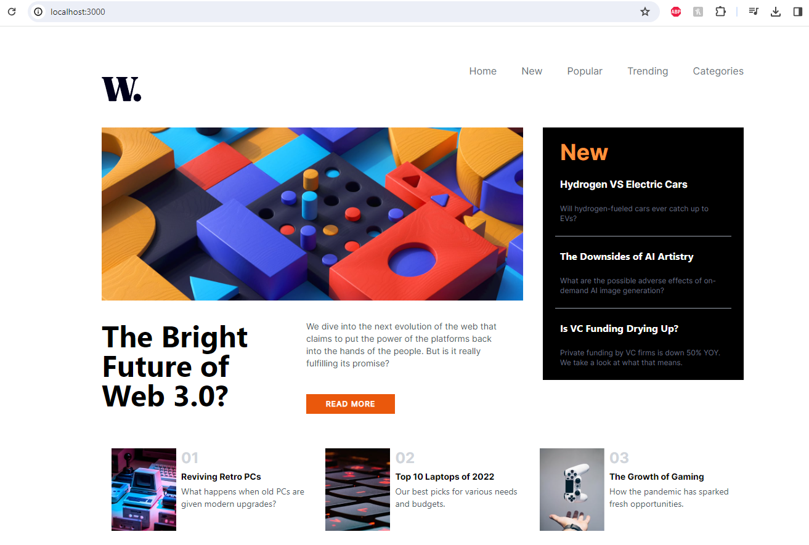

# Frontend Mentor - News homepage solution

In this project, I created a main News websit homepage based on information provided to me for design. The main technical frameworks I used were ReactJS, Tailwind CSS, and Vite. 

## Table of contents

- [Overview](#overview)
  - [The challenge](#the-challenge)
  - [Screenshot](#screenshot)
  - [Links](#links)
- [My process](#my-process)
  - [Built with](#built-with)
  - [What I learned](#what-i-learned)
  - [Continued development](#continued-development)
  - [Useful resources](#useful-resources)
- [Author](#author)
- [Acknowledgments](#acknowledgments)

**Note: Delete this note and update the table of contents based on what sections you keep.**

## Overview

### The challenge

Users should be able to:

- View the optimal layout for the interface depending on their device's screen size
- See hover and focus states for all interactive elements on the page

### Screenshot

Website Screenshots:


Example asked to match to:


Add a screenshot of your solution. The easiest way to do this is to use Firefox to view your project, right-click the page and select "Take a Screenshot". You can choose either a full-height screenshot or a cropped one based on how long the page is. If it's very long, it might be best to crop it.

Alternatively, you can use a tool like [FireShot](https://getfireshot.com/) to take the screenshot. FireShot has a free option, so you don't need to purchase it. 

Then crop/optimize/edit your image however you like, add it to your project, and update the file path in the image above.

**Note: Delete this note and the paragraphs above when you add your screenshot. If you prefer not to add a screenshot, feel free to remove this entire section.**

### Links

- Github Repo: [Github Repo news-homepage] https://github.com/lavollmer/news-homepage
- Live Site URL: [News Homepage Netlify](https://news-homepage-lauradev.netlify.app/)
- Substack Article Solution: [Add solution URL here](https://your-solution-url.com)

## My process

1. Set up Github Repo - The first steps to my process were to set up my Github Repo publically. I created a Github Repo called news-homepage. After that, I synced my Github Repo with my local machine and intiatlized the Repo. 
2. Set up React/Vite/Node.js/TailwindCSS - Tailwind CSS is a utility-first CSS framework that provides a wide range of pre-defined classes to style your website or application
3. Run npm dev to see the website and that everything was functioning properly
4. Reviewed the notes and suggestions for the news-homepage design and challenge
5. Set up site on Netlify - Configure your repository to publish your code to a web address. This will also be useful if you need some help during a challenge as you can share the URL for your project with your repo URL. 
6. Planning process for design with ReactJS and JavaScript
  a. Extract zip file to open images and be able to move into the assets/images folder
  b. Installed "ES7+ React/Redux/React-Native snippets" extension - to be able to use short commands in React
  c. Installed font required for project to computer
  d. Install react-router-dom for navigation between pages
  e. Install prettier to format document
7. Structure your content with HTML. Writing your HTML first can help focus your attention on creating well-structured content. Went to the copywriting provided and updated.
8. Started with the navigation bar and build. Planning out reusable pieces to build the application.
9. Went down the page and built out the main sections to a get a resemblance of what it should look like
10. Went back and tweaked areas that needed improvement 
  a. removed excess component thought I would need but didn't - countdowncards to countdown - didn't need to
  b. Increased the pt to 10 to push down the application a bit to match the example
  c. Styling the countdown section - updated
11. Font styling 
12. Color styling with Coolors
13. Functionality with hover and focus states of user areas

### Built with

- Semantic HTML5 markup
- CSS custom properties
- Flexbox
- ReactJS
- Next.js
- Tailwind CSS
- Vite
- Mobile-first workflow
- [React](https://reactjs.org/) - JS library
- [Next.js](https://nextjs.org/) - React framework
- [Styled Components](https://styled-components.com/) - For styles

**Note: These are just examples. Delete this note and replace the list above with your own choices**

### What I learned

1. Extract zip file on Microsoft to be able to access images to move into folder
2. Do not delete your public index.html file - I had to go back to Github previous commit save --> bring it back
3. React-router-dom --> you need to wrap your index.js file with it to get all functionality of the router dom for all components
4. Added manifest.json file due to console error "Manifest: Line: 1, column: 1, Syntax error." Realized related to index.html file in public folder - removed mention of manifest file in index.html folder and worked - removed error
5. Added button component in App.js when really needed in another component - imported with no use and ESLint errored a message. Also button HTML is <button> and not <Button>
6. Ran npm run build in terminal to rebuild the project - tailwind css was not set up correctly/being imported
7. Grid container formatting for the countdown sections - formatting the divs to make sense - switched to 6 columns instead of 3
8. Styling the button itself and not the container the button sits in - 
9. span props for the container
10. Using font presented - downloaded in font translator

Use this section to recap over some of your major learnings while working through this project. Writing these out and providing code samples of areas you want to highlight is a great way to reinforce your own knowledge.

To see how you can add code snippets, see below:

```html
<h1>Some HTML code I'm proud of</h1>
```
```css
.proud-of-this-css {
  color: papayawhip;
}
```
```js
const proudOfThisFunc = () => {
  console.log('🎉')
}
```

If you want more help with writing markdown, we'd recommend checking out [The Markdown Guide](https://www.markdownguide.org/) to learn more.

**Note: Delete this note and the content within this section and replace with your own learnings.**

### Continued development

Use this section to outline areas that you want to continue focusing on in future projects. These could be concepts you're still not completely comfortable with or techniques you found useful that you want to refine and perfect.

**Note: Delete this note and the content within this section and replace with your own plans for continued development.**

### Useful resources

- [Example resource 1](https://www.example.com) - This helped me for XYZ reason. I really liked this pattern and will use it going forward.
- [Example resource 2](https://www.example.com) - This is an amazing article which helped me finally understand XYZ. I'd recommend it to anyone still learning this concept.

**Note: Delete this note and replace the list above with resources that helped you during the challenge. These could come in handy for anyone viewing your solution or for yourself when you look back on this project in the future.**

## Author

- Website - [Add your name here](https://www.your-site.com)
- Frontend Mentor - [@yourusername](https://www.frontendmentor.io/profile/yourusername)
- Twitter - [@yourusername](https://www.twitter.com/yourusername)

**Note: Delete this note and add/remove/edit lines above based on what links you'd like to share.**

## Acknowledgments

This is where you can give a hat tip to anyone who helped you out on this project. Perhaps you worked in a team or got some inspiration from someone else's solution. This is the perfect place to give them some credit.

This project was done based upon Frontend Mentor. Frontend Mentor challenges help you improve your coding skills by building realistic projects. 

**Note: Delete this note and edit this section's content as necessary. If you completed this challenge by yourself, feel free to delete this section entirely.**
